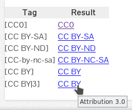
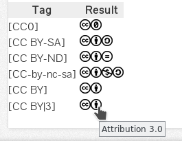
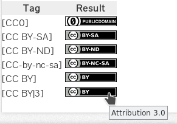
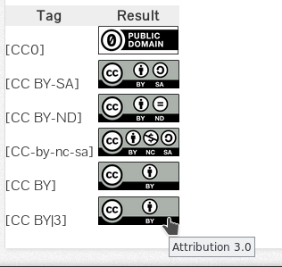

# Grav CreativeCommon-Link Plugin

Simple plugin to create links to creative-common licences. 
All you need to do is adding e.g. `[CC-BY-SA]` to your content and the plugin creates an Link (text, images, buttons) with title and link to the corresponding deed.

Type of replacement is configurable, here are some examples:

|           Text                 |         Icons                 |
| :----------------------------: | :---------------------------: |
|        |     |
|     **Badge**                  |          **Button**           |
|      |   |

## Installation

Installing the plugin can be done in one of two ways. The GPM (Grav Package Manager) installation method enables you to quickly and easily install the plugin with a simple terminal command, while the manual method enables you to do so via a zip file.

### GPM Installation (preferred)

The simplest way to install this plugin is via the [Grav Package Manager (GPM)](http://learn.getgrav.org/advanced/grav-gpm) through your system's Terminal (also called the command line).  From the root of your Grav install type:

    bin/gpm install cclinker

This will install the `reCAPTCHA Contact` plugin into your `/user/plugins` directory within Grav. Its files can be found under `/your/site/grav/user/plugins/recaptchacontact`.

### Manual Installation

To install this plugin, just download the zip version of this repository and unzip it under `/your/site/grav/user/plugins`. Then, rename the folder to `cclinker`. You can find these files either on [GetGrav.org](http://getgrav.org/downloads/plugins#extras) or the [cclinker GitHub repo](https://github.com/BugHunter2k/grav-plugin-cclinker).

You should now have all the plugin files under

    /your/site/grav/user/plugins/cclinker

> NOTE: This plugin is a modular component for Grav which requires [Grav](http://github.com/getgrav/grav).

## Configuration

The plugin let you choose the type of link, see examples above. 
Options in `cclinker.yaml`
 outputformat: (text|button|badge|icons)

## Usage

If you want an cc-link, simply put `[CC-BY]` in your markdown.

Accepted Licences are :
| `CC0` | `CC BY-SA` | `CC BY-ND` | `CC BY-NC-SA` | `CC BY-SA` | `CC BY-NC` | `CC BY-NC-ND` | `publicdomain` |

Linking to a particular licence-version is possible by adding e.g `|3.0` to the code.

> Note: to prevent mistakes the plugin is case insensitive and a `-` after `CC` is ignored

## Updating

As development for this plugin continues, new versions may become available that add additional features and functionality, improve compatibility with newer Grav releases, and generally provide a better user experience. Updating this plugin is easy, and can be done through Grav's GPM system, as well as manually.

### GPM Update (preferred)

The simplest way to update this plugin is via the [Grav Package Manager (GPM)](http://learn.getgrav.org/advanced/grav-gpm). You can do this by navigating to the root directory of your Grav install using your system's Terminal (also called command line) and typing the following:

    bin/gpm update cclinker

This command will check your Grav install to see if your plugin is due for an update. If a newer release is found, you will be asked whether or not you wish to update. To continue, type `y` and hit enter. The plugin will automatically update and clear Grav's cache.

### Manual Update

Manually updating this plugin is pretty simple. Here is what you will need to do to get this done:

* Delete the `your/site/user/plugins/cclinker` directory.
* Download the new version of the plugin from either [GetGrav.org](http://getgrav.org/downloads/plugins#extras) or the [cclinker GitHub repo](https://github.com/BugHunter2k/cclinker).
* Unzip the zip file in `your/site/user/plugins` and rename the resulting folder to `cclinker`.
* Clear the Grav cache. The simplest way to do this is by going to the root Grav directory in terminal and typing `bin/grav clear-cache`.

> Note: Any changes you have made to any of the files listed under this directory will also be removed and replaced by the new set. Any files located elsewhere (for example a YAML settings file placed in `user/config/plugins`) will remain intact.

<small> Logo and Icons are [CC-BY Creative commons](https://creativecommons.org/licenses/by/4.0/)</small>
